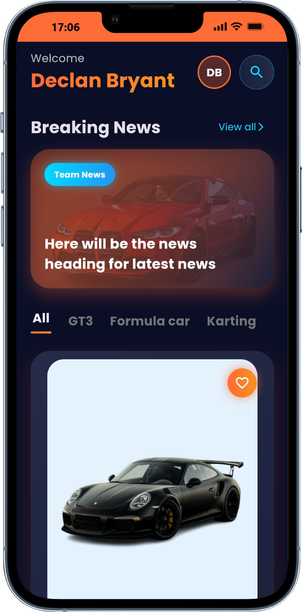

# Rental Car

A **Premium Car Rental Showcase App** built with Flutter.

This app features a high-end UI design with smooth **Hero animations**, **complex page transitions**, and interactive elements. It mimics a luxury car rental experience with detailed car specifications and a sleek dark theme.

## Screenshots

  
  
  
  

## Getting Started

This project is a starting point for a Flutter application.

A few resources to get you started if this is your first Flutter project:

- [Lab: Write your first Flutter app](https://docs.flutter.dev/get-started/codelab)
- [Cookbook: Useful Flutter samples](https://docs.flutter.dev/cookbook)

For help getting started with Flutter development, view the
[online documentation](https://docs.flutter.dev/), which offers tutorials,
samples, guidance on mobile development, and a full API reference.
